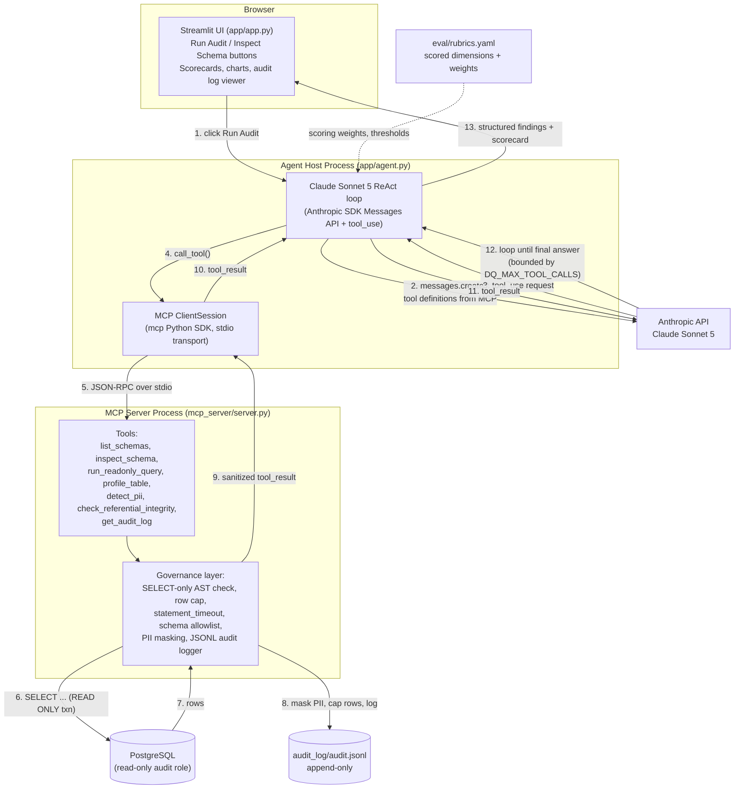
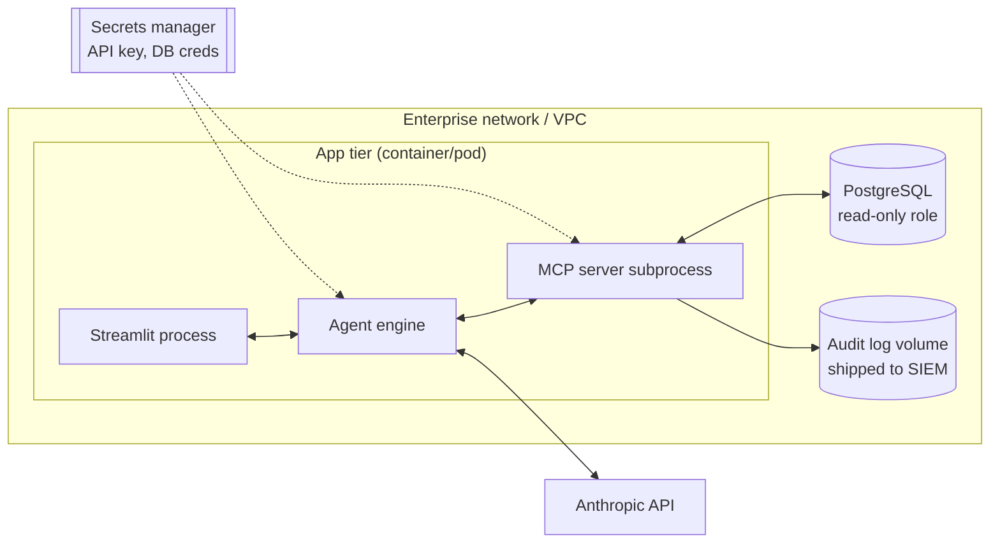

# High-Level Design (HLD)
## Data Quality & Governance Agent

| Field | Value |
|---|---|
| Document ID | HLD-DQGA-03 |
| Traces from | `02-requirements/FRD-SRS.md` |
| Traces to | `12-eval-rubrics/`, `mcp_server/`, `app/` |

## 1. Architecture overview

The system is four processes/components talking over two boundaries: a
**UI boundary** (Streamlit ↔ agent engine, in-process) and an **MCP
boundary** (agent engine ↔ Postgres tools, out-of-process, over stdio).
The MCP boundary is what makes the tool surface reusable outside
Streamlit — the same `mcp_server` process is a valid target for Claude
Code or Claude Desktop.

This is the same shape as the architecture diagram in the project brief
(Streamlit → Python agent engine → tool call → Postgres, Claude analyzes
and returns a formatted report), with the tool boundary formalized as
MCP instead of ad-hoc function calling, so it is a first-class,
independently reusable component (FR-150/151) rather than something
wired only into `app.py`.

## 2. Component responsibilities

### 2.1 Streamlit UI — `app/app.py`, `app/ui/`

- Sidebar: connection status (masked DSN), schema allowlist, model
  selector, rubric version in effect.
- "Inspect Schema" button → calls agent in a lightweight mode (schema
  tools only) → renders a browsable table/tree (FR-110/112).
- "Run Audit" button → user optionally scopes to selected tables
  (FR-124) → streams live progress (which tool is running, NFR-209) →
  renders the scorecard (per-dimension gauges), a findings table
  (sortable by severity), and a "Download Report" button (FR-143).
- "Audit Log" tab → reads `audit_log/audit.jsonl` directly (not through
  the agent) filterable by time/tool (FR-142).
- Never receives raw PII from the agent layer — the UI only ever
  renders what the MCP governance layer already masked (FR-130).

### 2.2 Agent engine — `app/agent.py`

- Wraps `anthropic.Anthropic().messages.create()` in a bounded ReAct
  loop: send messages + tool defs → if `stop_reason == "tool_use"`,
  execute via the MCP client, append `tool_result`, loop; else return
  the final structured answer. Loop is capped at
  `DQ_MAX_TOOL_CALLS` (FR-121) to bound cost and latency.
- On startup, opens one `mcp.ClientSession` (stdio) to
  `mcp_server/server.py` and calls `list_tools()`; the returned tool
  schemas are translated directly into Anthropic tool-use `tools=[...]`
  definitions — the agent never hand-maintains a second copy of the
  tool contract (single source of truth is the MCP server).
- System prompt encodes the governance policy in force: baseline checks
  to always run (FR-120), the rubric dimensions and how to map a
  finding to one, the instruction to never request or echo raw PII, and
  the requirement that every finding cite table/column/evidence
  (FR-122).
- Output is validated against a JSON Schema (`eval/schemas/findings.schema.json`)
  before being handed to the UI — an agent response that doesn't parse
  as valid structured findings is treated as a failed run, not silently
  passed through.

### 2.3 MCP server — `mcp_server/`

Tools exposed (see `mcp_server/server.py` for authoritative schemas):

| Tool | Purpose | Key guardrail |
|---|---|---|
| `list_schemas` | Enumerate schemas visible to the role | filtered by `DQ_ALLOWED_SCHEMAS` |
| `inspect_schema` | Tables, columns, types, PK/FK, nullability for a schema | single batched `information_schema` query (FR-111) |
| `run_readonly_query` | Execute an agent-composed `SELECT` | AST-validated SELECT-only, row-capped, timeout-capped (NFR-201/202) |
| `profile_table` | Null rate, distinct count, min/max, top-N values per column | aggregates only, no raw rows returned |
| `detect_pii` | Sample rows, run pattern + column-name PII detectors, return masked summary | raw values never leave this tool (FR-130) |
| `check_referential_integrity` | Orphaned FK scan, duplicate PK/unique-constraint scan | aggregate counts only |
| `get_audit_log` | Read back recent audit log entries | read of the log itself, not the DB |

Cross-cutting, applied to every tool via a shared decorator/middleware
(`mcp_server/tools/governance.py`):

1. **Schema allowlist check** — reject if target schema not in
   `DQ_ALLOWED_SCHEMAS`.
2. **Read-only transaction** — every DB call runs inside
   `BEGIN READ ONLY; SET LOCAL statement_timeout = ...;`.
3. **Row cap** — result sets truncated to `DQ_MAX_ROWS`, with a
   `truncated: true` flag returned so the agent knows.
4. **PII masking** — any column flagged by `detect_pii` heuristics is
   masked in *every* tool's output, not just `detect_pii` itself.
5. **Audit logging** — one JSONL line per call, written before the
   result is returned, containing tool name, args, row count, duration,
   truncated flag — never raw PII (FR-140/141).

### 2.4 Database layer — `mcp_server/tools/db.py`

A thin `psycopg`-based connection layer behind an interface
(`DBAdapter`), so Postgres-specific SQL (`information_schema`,
`pg_constraint`) is isolated from the tool logic and from the agent
entirely (NFR-210). A second adapter for another engine later is a new
file implementing the same interface, not a rewrite.

### 2.5 Eval harness — `eval/`

- `rubrics.yaml` — the versioned, business-owned definition of what
  "quality" means: dimensions, weights, scoring rules, PII detection
  thresholds (BRD BR-08).
- `eval/fixtures/` — seeded mini-databases (via `db/seed/`) each
  representing a known defect pattern (nulls, dupes, orphaned FKs, a
  PII-shaped column, a stale-data column) with a **golden findings
  file** stating exactly what a correct audit should report.
- `eval_runner.py` — runs the real agent against each fixture, diffs
  its findings against the golden file (dimension recall/precision,
  severity accuracy, zero-raw-PII-in-transcript check), and produces a
  pass/fail report gating release (BR-08, NFR-204). See
  `12-eval-rubrics/Eval-Rubric-Spec.md` for full detail.

## 3. Data flow — a single "Run Audit" click

1. User clicks **Run Audit** (optionally with a table selection).
2. `app.py` calls `agent.run_audit(scope=...)`.
3. `agent.py` sends the system prompt + user turn ("audit these
   tables...") + tool definitions to Claude.
4. Claude requests `inspect_schema` first (near-universal first move,
   reinforced by the system prompt) → MCP server returns schema.
5. Claude requests `profile_table` per table, `check_referential_integrity`
   for the schema, and `detect_pii` for columns whose name/type look
   suspicious — each call independently governed (masking, row cap,
   audit log) as in §2.3.
6. Once Claude has enough evidence (or hits `DQ_MAX_TOOL_CALLS`), it
   returns a final structured message: scorecard + findings array,
   matching `eval/schemas/findings.schema.json`.
7. `agent.py` validates the schema, computes the weighted composite
   score using `rubrics.yaml`, and returns it to `app.py`.
8. `app.py` renders it and offers the Markdown report download
   (FR-143); every step 4–6 tool call is already durably recorded in
   `audit_log/audit.jsonl` independent of what made it into the final
   report (BR-06).

## 4. Governance & security model

- **Least privilege**: dedicated `dq_audit_reader` Postgres role,
  `SELECT`-only, see `db/README.md` for the exact `GRANT` statements.
- **Defense in depth**: even a misconfigured role cannot write, because
  the MCP server independently blocks non-`SELECT` statements at the
  AST level (NFR-207) and runs everything in an explicit
  `READ ONLY` transaction.
- **PII never reaches the model**: masking happens in the governance
  middleware, before the tool result is serialized for the agent — not
  as a prompt instruction the model could ignore (NFR-204).
- **Secrets**: `ANTHROPIC_API_KEY` and DB credentials come from env
  vars / the platform secrets manager; never logged, never in the audit
  trail, never in the downloadable report (NFR-205).
- **Auditability**: the JSONL audit log is the source of truth for "what
  did the agent actually do" — independent of, and a stricter record
  than, the agent's own summarized findings (NFR-208).

## 5. Deployment view (enterprise)

- Streamlit, the agent engine, and the MCP server run as one deployable
  unit (the MCP server is a child process of the agent engine, stdio
  transport) — no new network-exposed service is introduced.
- The audit log volume is shipped to the enterprise's existing SIEM/log
  pipeline for independent retention, satisfying BR-06 without the app
  being the system of record.
- Outbound network: only Postgres (internal) and the Anthropic API
  (HTTPS) — no other egress required.

## 6. Failure modes & handling

| Failure | Handling |
|---|---|
| DB unreachable | Tool call raises; agent surfaces a clear error in the UI, no partial/misleading scorecard is shown. |
| Statement timeout hit | Tool returns `timed_out: true` with partial context; agent reports the table as "audit incomplete" rather than guessing. |
| Claude hits `DQ_MAX_TOOL_CALLS` before finishing | Agent forces a final-answer turn summarizing what was covered and explicitly listing tables not yet audited — never fabricates findings for unexamined tables. |
| Tool result fails the findings JSON Schema | Run is marked failed; nothing is shown as a trustworthy scorecard (fail closed, not open). |
| PII masking heuristic misses a column | Caught by the eval suite's fixture with a PII-shaped column (§2.5) before release; in production, a governance reviewer can flag a missed column via FR-132 override, feeding back into `rubrics.yaml`. |

## 7. Extensibility notes

- New DB engine: implement `DBAdapter` (§2.4); tool schemas and the
  agent/UI are engine-agnostic.
- New rubric dimension: add to `rubrics.yaml` + a fixture in
  `eval/fixtures/`; no code change required for the scoring math.
- New MCP client (Claude Code, Claude Desktop): point it at
  `mcp_server/server.py` directly — it is not Streamlit-specific.
