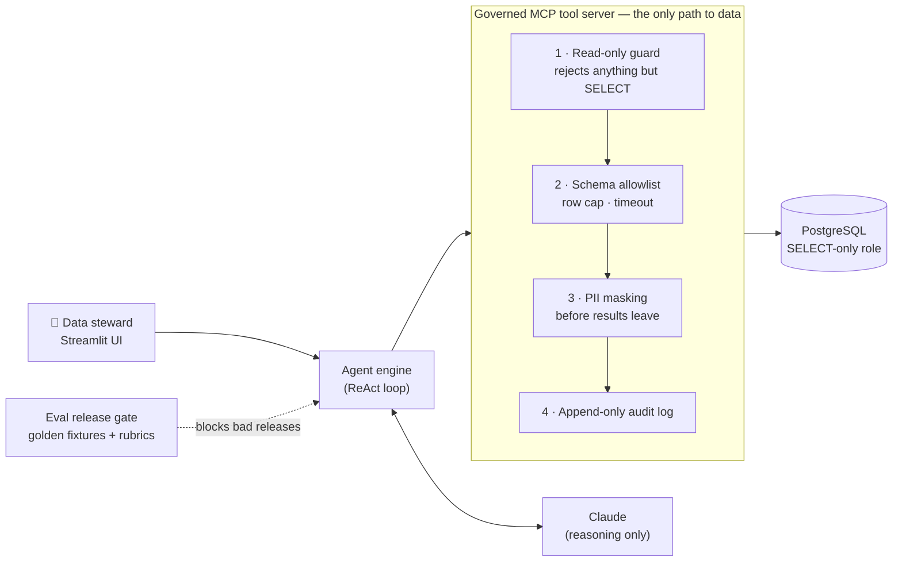

# Data Quality & Governance Agent

**An AI agent that audits a company's database for data quality and privacy risk — with the governance controls built in, not bolted on.**

> Most AI projects stall because the data isn't trustworthy and nobody can prove what the AI did.
> This project shows both halves of the fix: an agent that *finds* data problems, and a control
> design that makes the agent itself safe to let near production data.

**Built by:** Rasmi Murugavel · VectorCognitive · Data Quality & AI Governance · [LinkedIn](https://www.linkedin.com/in/mrasmi)
**My role:** Defined the problem and the governance approach, directed the build and documentation with Claude Code (AI-assisted development), and reviewed and tested the results.
**Status:** Self-directed portfolio build. Governance layer verified against a live database; see [What's verified](#whats-verified-and-whats-not).

---

## The problem

Companies want to use AI on their data. Two things stop them:

1. **The data isn't AI-ready.** Missing values, duplicate records, broken links between tables, stale data and personal information sitting in the wrong place. AI trained or grounded on this data gives confident, wrong answers.
2. **Nobody trusts an AI agent near production data.** What if it changes something? Sends customer emails to an outside AI provider? Makes up a finding? How would an auditor know what it actually did?

## What it does

1. **Inspect** — lists every table and column the agent is allowed to see. No data is read.
2. **Audit** — runs a data quality baseline on every table in scope (null rates, duplicate keys, orphaned foreign keys, personal-data detection), then decides what else to investigate based on what it finds.
3. **Score** — a 0–100 scorecard per table across five standard data quality dimensions: completeness, validity, uniqueness, consistency, timeliness.
4. **Report** — a severity-ranked findings list and a self-contained report an auditor can read without the app.
5. **Log** — every action the agent took, recorded independently of what it chose to report.

## Architecture



**Why it's built this way:** the AI decides *what* to check, but it can only act through a fixed, locked-down toolbox. Every safety rule lives in code the model can't talk its way around — not in a prompt it could ignore.

A beginner-friendly visual walkthrough is in [`insideauditagent.html`](insideauditagent.html). Full technical design: [`03-design/HLD.md`](03-design/HLD.md).

## Governance controls at a glance

| Risk | Control | Where |
|---|---|---|
| Agent changes or deletes data | Read-only enforced twice: a `SELECT`-only database role **and** a code-level guard that rejects any other statement | `db/README.md`, `mcp_server/tools/db.py` |
| Customer personal data sent to the AI provider | PII masked in the tool layer before any result reaches the model | `mcp_server/tools/pii.py`, `governance.py` |
| No record of what the AI did | Append-only log of every query, row count and duration | `mcp_server/tools/audit_log.py` |
| AI makes up findings or quietly gets worse | Every release scored against test databases with known answers; blocked if it misses the bar | `eval/rubrics.yaml`, `eval/eval_runner.py` |
| AI claims it checked tables it didn't | Budget limits force an honest "not audited" list instead of a guess | `app/agent.py` |

**Release gate** (from `eval/rubrics.yaml`): recall ≥ 85% per dimension · precision ≥ 70% · severity accuracy ≥ 75% · **zero** PII leaks, no tolerance.


## What's verified, and what's not

I document what was actually run, not what the code is designed to do.

**Verified**
- Read-only guard: 7 attack/allow cases behave correctly, including a `DELETE` hidden inside a `WITH` clause.
- PII masking on synthetic data; no raw value appears in any output.
- Audit log records both successful and failed calls.
- Live integration tests against a real Postgres instance under the real least-privilege role.
- Eval scoring math and release gate (a good run passes; a bad run with a PII leak fails for all four reasons).

**Found by running it — and fixed**
- **DEF-001 (critical):** a SQL injection path through a column name that the read-only check alone did not catch.
- **DEF-003 (critical):** key detection silently returned nothing under the real least-privilege role — invisible in any test not run with production permissions.
- **DEF-004 (high):** a query parameter that failed only against a live database.

**Not yet done**
- An end-to-end eval run against the live model.
- UAT sign-off.
- DEF-002 (medium): saving governance overrides between runs (FR-132) is specified but not built.

Details: [`09-test-execution/Execution-Summary.md`](09-test-execution/Execution-Summary.md), [`10-defects/Defect-Log.md`](10-defects/Defect-Log.md).

---

## Quickstart (local)

```bash
cp .env.example .env               # add your ANTHROPIC_API_KEY
python -m venv .venv && source .venv/bin/activate
pip install -r requirements.txt

docker compose up -d               # Postgres 16, auto-seeded with test data
make test                          # unit + live integration tests
make run                           # opens the Streamlit app
```

No Docker? Any local Postgres 16+ works — see [`db/README.md`](db/README.md).

The tool server also runs on its own (`python -m mcp_server.server`), so Claude Desktop, Claude Code or any MCP client can use the same governed tools.

## Project layout

| Path | What |
|---|---|
| `mcp_server/` | Governed, read-only Postgres tool server (9 tools: schema, profiling, integrity, duplicates, PII, audit log) |
| `app/` | Streamlit UI and the Claude agent engine |
| `eval/` | Rubrics, golden test fixtures, release-gate runner |
| `db/` | Read-only role setup and seeded test scenarios |
| `tests/` | Unit and live integration tests |
| `01`–`11` | Full lifecycle documentation: BRD → requirements → design → test strategy, plan, cases, edge cases → traceability → execution → defects → UAT |
| `12-eval-rubrics/` | Evaluation framework specification |
| `docs/` | Case study |

Start with [`01-business-requirements/BRD.md`](01-business-requirements/BRD.md) and follow the numbered folders; every requirement traces to a test in [`08-traceability/RTM.md`](08-traceability/RTM.md).
